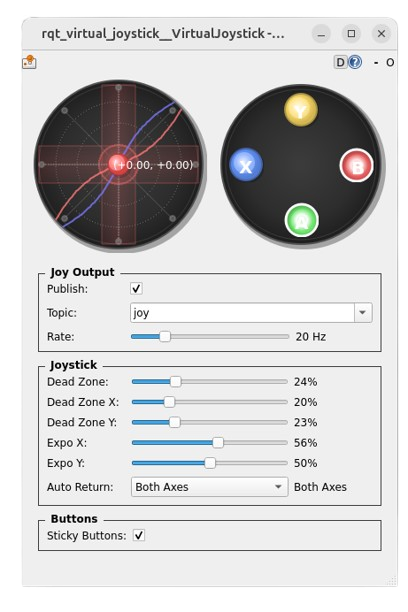

# RQT Virtual Joystick Plugin

A lightweight RQT plugin that emulates a joystick so you can publish `sensor_msgs/Joy` messages without physical hardware. It is designed for ROS 2 Humble users who need a quick way to prototype teleoperation, validate control pipelines, or build demos.



## Features
- Publish virtual joystick input on any topic using the standard `sensor_msgs/Joy` schema.
- Tune behaviour with independent dead zones, exponential response curves, and return-to-center modes.
- Enable sticky button mode to latch button presses for persistent commands.
- Live visual feedback for axes and face buttons to confirm the state that is being published.
- Stores the latest configuration so you can resume where you left off.

## Installation
1. Clone the package into your ROS 2 workspace:
   ```bash
   cd ~/colcon_ws/src
   git clone https://github.com/amgaber95/rqt_virtual_joystick.git
   ```
2. Build the package from the workspace root:
   ```bash
   cd ~/colcon_ws
   colcon build --symlink-install --packages-select rqt_virtual_joystick
   ```
3. Source the workspace before launching RQT:
   ```bash
   source install/setup.bash
   ```

## Launch Options
Choose whichever entry point best fits your workflow:
- Start the full RQT application and load the plugin manually:
  ```bash
  rqt
  ```
- Launch the plugin in standalone mode:
  ```bash
  rqt --standalone rqt_virtual_joystick
  ```
- Run the entry point directly:
  ```bash
  ros2 run rqt_virtual_joystick rqt_virtual_joystick
  ```

Inside RQT you can also reach the plugin via **Plugins → Robot Tools → Virtual Joystick** or by searching for `rqt_virtual_joystick` in the plugin browser.

## Operating the Plugin
1. In the **Joy Output** panel, select a target topic (for example `joy` or `teleop/joy`) and toggle **Publish** when you are ready to stream data.
2. Use the joystick pad and the face buttons to generate input while observing the corresponding ROS topic.
3. Adjust the tuning sliders to match the feel of your target hardware or scenario.

## Panels & Controls
### Joy Output
- **Publish** – master enable/disable switch for emitting `sensor_msgs/Joy` messages.
- **Topic** – editable combo box for choosing the publish topic.
- **Rate** – frequency (Hz) at which messages are published.

### Joystick
- **Dead Zone / Dead Zone X / Dead Zone Y** – suppress small inputs globally or per axis.
- **Expo X / Expo Y** – apply exponential response (0–100%) for finer control near center.
- **Auto Return** – configure whether the stick recenters on both axes, a single axis, or not at all.

### Buttons
- **Sticky Buttons** – latch button presses until toggled again, useful for sustained commands.
- Visual styling changes clearly indicate which buttons are active.